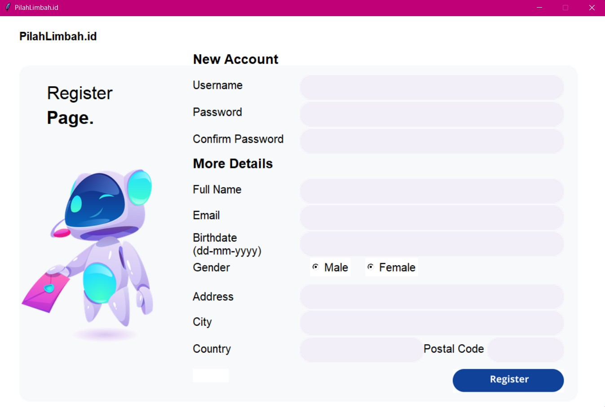
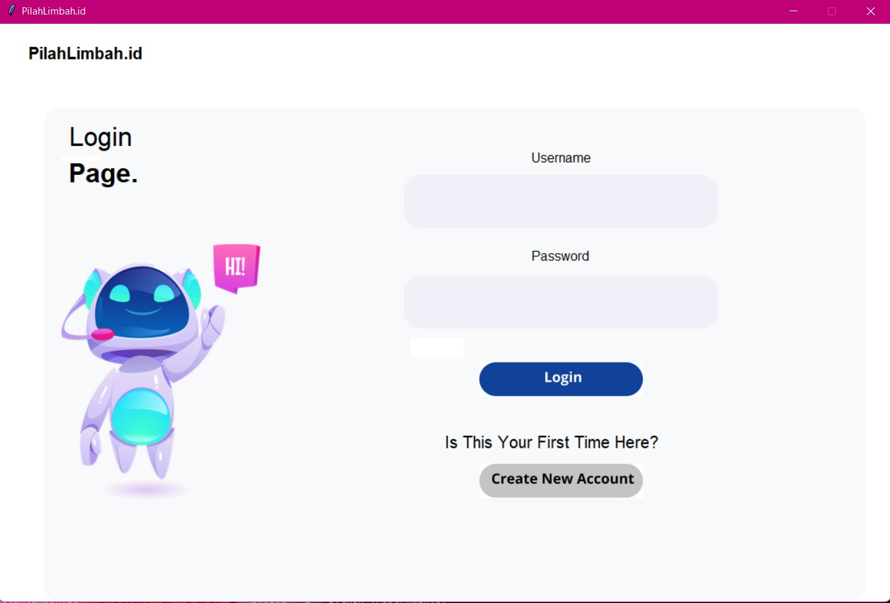

# IF2250-2021-K02-10-PilahLimbah.id

Tugas 7
IF2250 - Rekayasa Perangkat Lunak
Implementasi Perancangan Perangkat Lunak

## Deskripsi
Sebuah aplikasi yang menangani permasalahan sampah perkotaan. Di dalamnya terdapat beberapa fitur, yaitu profil, pembayaran, kalender, dan sebagainya.

## Requirements
Python 3

## Cara Menjalankan Aplikasi
1. Lakukan git clone pada repository ini
- Windows
```shell
git clone https://gitlab.informatika.org/firizky29/if2250-2021-k02-10-pilahlimbah.id.git
```
- Linux
```shell
git clone git@gitlab.informatika.org:firizky29/if2250-2021-k02-10-pilahlimbah.id.git
```
2. Lakukan instalasi modul yang diperlukan
```shell
pip install requirements.txt
```
3. Buka direktori menggunakan terminal
4. Ketik perintah
```shell
python ./src/main.py
```

## Implementasi Modul
|NIM|Nama|Modul|
|---|---|---|
|13520047|Hana Fathiyah|Calendar Management|
|13520053|Yohana Golkaria Nainggolan|Account Management|
|13520095|Firizky Ardiansyah|Transaction Management|
|13520152|Muhammad Fahmi Irfan|Dashboard Management|

### _Screenshot_ Tampilan Layar

#### a. Register Page


#### b. Login Page


## Daftar Tabel Basis Data

### Diagram Basis Data


## Author
1. 13520047 Hana Fathiyah
2. 13520053 Yohana Golkaria Nainggolan
3. 13520095 Firizky Ardiansyah
4. 13520152 Muhammad Fahmi Irfan
