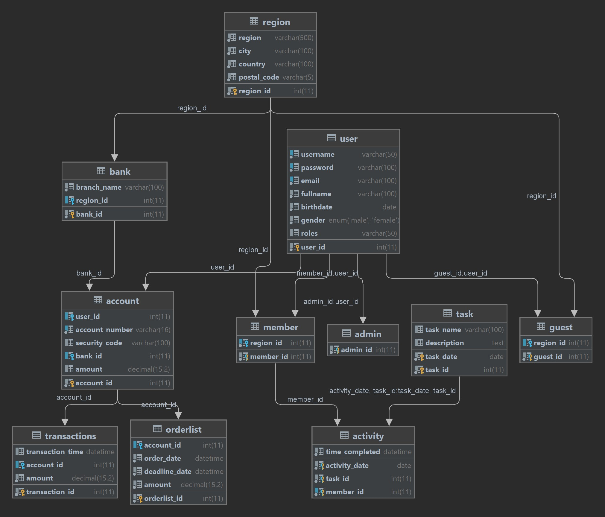

# IF2250-2021-K02-10-PilahLimbah.id

Tugas 7
IF2250 - Rekayasa Perangkat Lunak
Implementasi Perancangan Perangkat Lunak

## Deskripsi
Nama perangkat lunak yang akan dibuat adalah PilahLimbah.id. Perangkat lunak ini merupakan sebuah perangkat lunak yang menangani pengelolaan sampah di daerah perkotaan. Pada perangkat lunak ini, terdapat jadwal pengambilan sampah dan jenis sampah yang akan diambil pada hari tersebut. Selain itu, perangkat lunak ini juga memiliki fitur terkait cara membuang sampah sesuai jenisnya yang dapat diakses oleh semua pengguna. 

Perangkat lunak ini dibangun menjadi beberapa subsistem di antaranya, sistem login dan register bertujuan untuk mengakomodasi pengguna ketika melakukan proses login dan register, sistem akses bertujuan untuk menyaring hak akses sekaligus mengatur kontrol akses pengguna ketika memasuki sesi user, sistem manajer konten bertujuan untuk mengakomodasi konten umum dan konten dialog bagi pengguna, sistem log aktivitas merupakan sistem khusus dari konten yang tujuannya untuk memberikan konten kalender bagi pengguna, sistem transaksi meliputi keamanan bertransaksi, verifikasi, dan dialog dengan pengguna ketika melakukan transaksi, serta sistem profil bertujuan untuk mengatur profil sekaligus menampilkannya pada layar.


## Requirements
Python 3
Internet Connection

## Cara Menjalankan Aplikasi
1. Lakukan git clone pada repository ini
- Windows
```shell
git clone https://gitlab.informatika.org/firizky29/if2250-2021-k02-10-pilahlimbah.id.git
```
- Linux
```shell
git clone git@gitlab.informatika.org:firizky29/if2250-2021-k02-10-pilahlimbah.id.git
```
2. Lakukan instalasi modul yang diperlukan
```shell
pip install requirements.txt
```
3. Buka direktori menggunakan terminal
4. Ketik perintah
```shell
python ./src/main.py
```
Akun bank baru hanya bisa ditambahkan melalui database, akun bank yang tersedia hanya satu. atas nama akun berikut:
```
username : pilahlimbahid
password : pilahlimbahid
```
Akun admin juga hanya bisa ditambahkan melalui database, akun yang telah tersedia
```
username : Admin 
password : pilahlimbahid
```
Untuk mengedit database bisa menuliskan perintah berikut pada command line:
```
mysql -u pilahlimbah@pilahlimbah -h pilahlimbah.mariadb.database.azure.com -p
password : BDDL&g38Mv
```
tambahkan akun sesuai kebutuhan.

## Implementasi Modul
|NIM|Nama|Modul|
|---|---|---|
|13520047|Hana Fathiyah|Calendar Management|
|13520053|Yohana Golkaria Nainggolan|Account Management|
|13520095|Firizky Ardiansyah|Transaction Management|
|13520152|Muhammad Fahmi Irfan|Dashboard Management|

### _Screenshot_ Tampilan Layar

#### a. Register Page


#### b. Login Page


#### c. Dashboard Admin


#### d. Dashboard Member


#### e. Profil Admin


#### f. Profil Guest


#### g. Profil Member


#### h. Halaman Tips and Trick


#### i. Halaman Pricing


#### j. Payment Detail


#### k. My Transaction


### l. Success Page


#### m. Calendar Page


## Daftar Tabel Basis Data

### Diagram Basis Data


## Author
Kelompok 10 Kelas 02
1. 13520047 Hana Fathiyah
2. 13520053 Yohana Golkaria Nainggolan
3. 13520095 Firizky Ardiansyah
4. 13520152 Muhammad Fahmi Irfan
